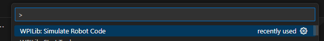
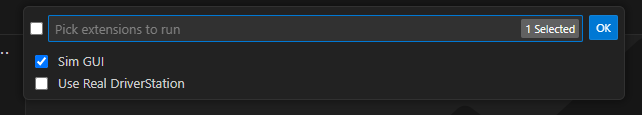
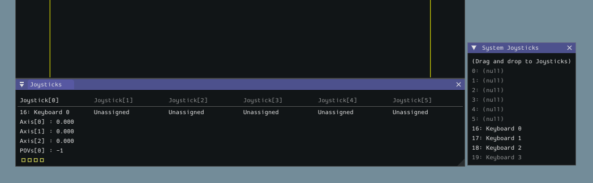
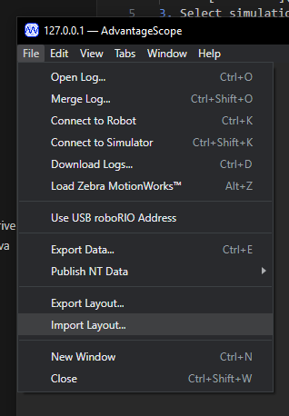
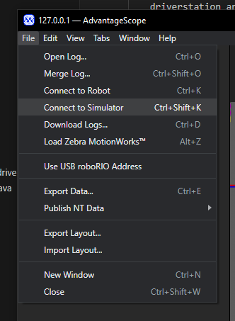
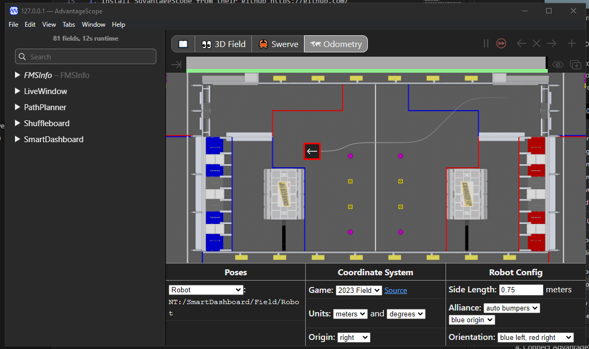
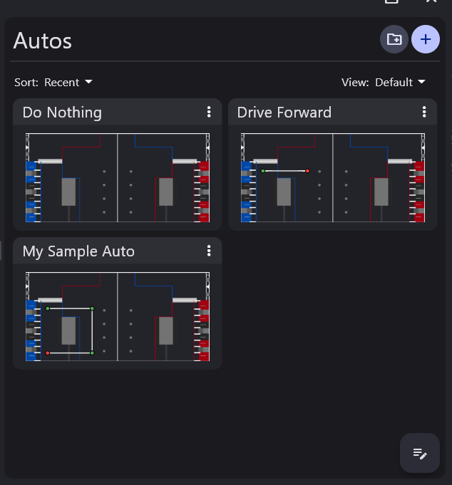
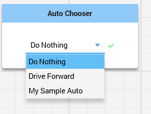
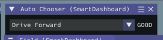

### How to Simulate Robot Code
1. ctl+shift+p in vs code
2. select "WPILib: SImulate Robot Code"
    - 
3. Select simulation options 
    - Select "Sim GUI" if you would like to use 
    - Select "Use Real DriverStation" if you would like to use the real driverstation and shuffleboard 
    - 
4. Connect your joysticks either in the DriverStation or the SIM GUI
    - In the sim GUI you need to drag the joystick from "System Joysticks" to the "Joystick" panel. This code uses Joystick 0.
    - 
    - In the FRC DriverStation you connect the joystick as usual

### Set Up AdvantageScope
1. Install SdvantageScope from their github https://github.com/Mechanical-Advantage/AdvantageScope
2. Open advantageScope
3. Open the dashboard included in this repo at ./AdvantageScope 11-19-2023.json
    - 
4. Connect AdvantageScope to your simulation
    - 
5. If done correctly you should see your robot on the field 
    - 
6. You can now use this to visulize your position on the field and visulize your individual swerve modules. 

### How to run Autonomus
1. Select you auto 
    - Select which auto you would like to run from the "Auto Chooser" this list will be populated from your Auto's section of PathPlanner

|  | 
|:--:| 
| *Pathplanner Autos* |

|  | 
|:--:| 
| *ShuffleBoard Auto Selector* |

|  | 
|:--:| 
| *Simulation Auto Selector* |

2. Once you have your auto selected you can enable the robot in autonomus and watch it follow the path!

### How to run Teleop
1. Enable the robot in Teleoperated
2. The driver joystick is controler 0
    - axis 0 (a/s on keyboard)= left/right
    - axis 1 (w/s on keyboard)= forward/backwards
    - axis 2 (r/e on keyboard)= rotation
    - button 1 (z on keyboard) = reset gyro
    - button 3 (c on keyboard)= Pathplann to feeder station and follow path
    - button 4 (v on keyboard)= pathplan to pose at scoring position
3. Make sure you hit button 3 and button 4 and watch your robot generate its paths on the fly to get to locations on the field!